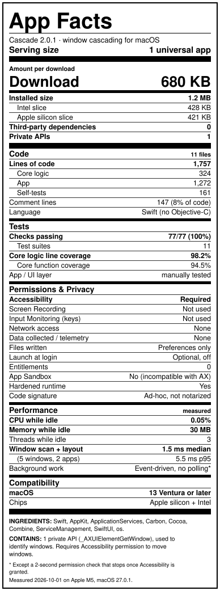
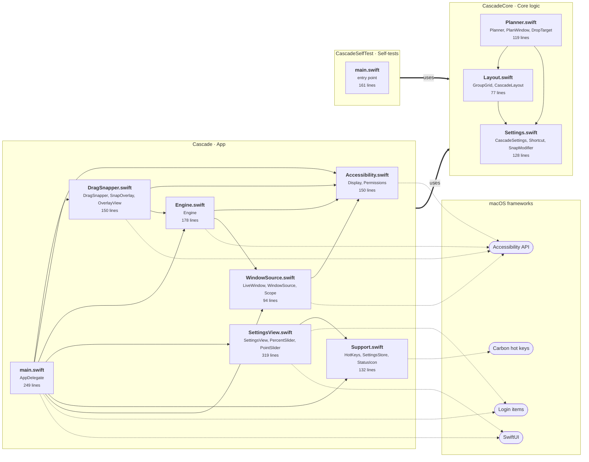
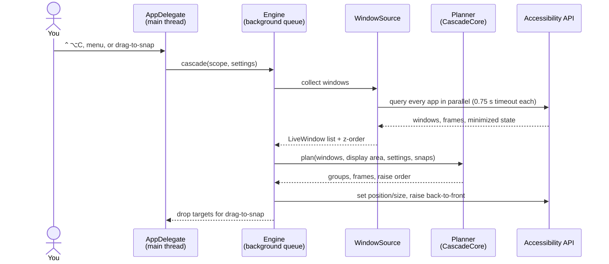

# Cascade

A macOS menu bar utility that arranges windows in a classic Windows-style cascade: every window
gets the same size and is offset diagonally, so its title bar and left edge stay visible and
clickable. Windows are grouped by application, and the window that was in front stays on top.
On large displays, windows can be split into several side-by-side **cascade groups**.

## App Facts

Like a nutrition label, but for software: what's inside, what it can access, and what it costs to run.
Every number is measured from the code and the built app by
[`scripts/repo_report.py`](scripts/repo_report.py) (raw data: [`docs/app-facts.json`](docs/app-facts.json)).

<p align="center"></p>

## Download

Grab the latest **Cascade-x.y.z.zip** from the
**[Releases page](https://github.com/hasansayani/MacOSApps-Cascade/releases/latest)**
(universal: Apple silicon + Intel, macOS 13 Ventura or later, including the latest macOS).

1. Unzip and drag **Cascade.app** into **/Applications**.
2. Open it. Because the app is not notarized by Apple, macOS blocks the first launch: open
   **System Settings → Privacy & Security**, scroll down and click **Open Anyway** next to Cascade.
   (Or run `xattr -dr com.apple.quarantine /Applications/Cascade.app` once.)
3. When asked, turn on Cascade under **Privacy & Security → Accessibility**.

The cascade icon appears in the menu bar. Press ⌃⌥C to cascade.

## Build from source

```bash
./install.sh
```

Runs the self-tests, builds a universal (Apple silicon + Intel) `Cascade.app`, copies it to
`/Applications`, and launches it. On first run, grant **Accessibility** access (System Settings →
Privacy & Security → Accessibility). macOS requires it to move other apps' windows.

`./build.sh` alone produces `build/Cascade.app` and a distributable `build/Cascade-<version>.zip`.
Builds are ad-hoc signed, so each rebuild needs Accessibility granted again (`install.sh` clears
the stale entry for you). Requires macOS 13+ and the Xcode command line tools.

## Use

| Action | Default shortcut |
| --- | --- |
| Cascade visible windows | ⌃⌥C |
| Cascade all windows (restores minimized windows and hidden apps) | ⌃⌥⇧C |
| Snap the focused window to group 1–9 | ⌃⌥1 … ⌃⌥9 |
| Snap by dragging | Drag a window while holding ⇧ and drop it on a group |

Everything is also available from the menu bar icon. Opening Cascade again from Finder or
Spotlight opens **Settings**.

## Settings

- **Window size**: *Fill group* (windows fill their group and shrink as the stack grows) or
  *Custom* width/height as a percentage of the group.
- **Visible part of windows underneath**: how many points of each covered window stay visible
  at the top (title bar) and left edge.
- **Cascade groups**: columns (or automatic, about one group per 1280 pt of width), rows, and the gap between groups.
  - *Group by application*: each app's windows stay together and apps are balanced across groups.
    Unused groups can give their space to the groups in use.
  - *Manual*: pin apps to specific groups. Unpinned apps are balanced across groups.
- **Snapping**: a snapped window stays in its group until it closes or you choose
  *Reset Snapped Windows*. Snapping re-lays only the groups that changed.
- **Displays**: gather everything onto the display under the pointer, or cascade each display separately.
- **Keyboard shortcuts**: click a shortcut field, then press a new shortcut. Esc cancels; Delete clears it.

A live preview at the top of Settings shows the resulting layout.

## Releasing

```bash
./release.sh 2.1.0      # bump version, build, tag, push, and publish a GitHub Release
```

Requires the GitHub CLI (`gh auth login`). Test the build locally with `./install.sh` first.

## Development

```
Sources/CascadeCore      pure layout + grouping logic (no AppKit)
Sources/Cascade          the menu bar app (Accessibility, hotkeys, drag-to-snap, SwiftUI settings)
Sources/CascadeSelfTest  assertion checks for CascadeCore
```

### Code graph

Each box is a source file, showing its main types and size. An arrow means "uses a type declared in";
dotted arrows lead to the macOS frameworks that need special capabilities.
Generated by `scripts/repo_report.py`.

<!-- code-graph:start -->

<!-- code-graph:end -->

### How a cascade runs



### Reports

```bash
scripts/repo_report.py        # rebuild, measure, regenerate the App Facts label and the code graph
```

```bash
swift run CascadeSelfTest     # core checks (no Xcode needed)
swift build                   # debug build
```

Only standard windows on the current Space are arranged. Full-screen windows, panels and dialogs
are skipped. Stacks too deep for one diagonal continue in a second pass to the right, so every
window keeps an exposed corner.
