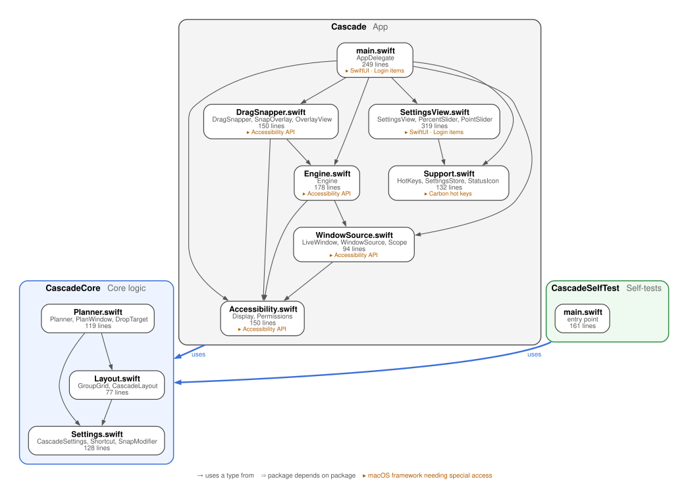
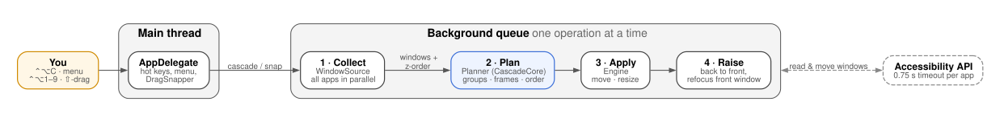

# Architecture

```
Sources/CascadeCore      layout and grouping logic: pure Swift, no AppKit
Sources/Cascade          the menu bar app: Accessibility, hot keys, drag-to-snap, SwiftUI settings
Sources/CascadeSelfTest  assertion checks for CascadeCore
```

## Code graph

Each box is a source file, with the types other files use most and its size. Orange tags mark
macOS frameworks that need special access. Generated from the source by `scripts/repo_report.py`.

<p align="center"><a href="code-graph.svg"></a></p>

## How a cascade runs

<p align="center"><a href="cascade-flow.svg"></a></p>

1. **Trigger**: a hot key, the menu, or a drop while drag-to-snap is active. `AppDelegate` passes
   the request to `Engine` with a snapshot of the settings. Requests that arrive while one is still
   running are dropped rather than queued.
2. **Collect**: `WindowSource` asks every regular app for its windows in parallel, in one batched
   Accessibility call per window, with a 0.75 s timeout so a hung app can't stall the cascade.
   Windows on other Spaces, full-screen windows, panels and dialogs are skipped. Front-to-back
   order comes from `CGWindowListCopyWindowInfo`.
3. **Plan**: `Planner` (in `CascadeCore`) assigns windows to groups, in this order: snapped
   windows, then manual app rules, then the remaining apps spread evenly. It then lays out the
   group regions and the cascade frames. Planning is pure, so it is covered by the self-tests.
4. **Apply**: `Engine` moves and resizes each window. Chrome and Electron apps' animation mode
   ("enhanced user interface") is switched off temporarily so the moves happen instantly.
5. **Raise**: windows are brought forward from back to front, one app at a time, and the window
   that was in front gets focus again.

Snapping uses the same pipeline, but only re-lays the groups whose contents changed.

## Notes

- **Deep stacks**: when a stack is too tall for one diagonal, it continues in another pass that
  starts to the right of the previous one, so every window keeps a visible corner.
- **Private API**: `_AXUIElementGetWindow` maps an Accessibility window to its `CGWindowID`. It is
  also used by Rectangle and AltTab.
- **Global hot keys** use Carbon's `RegisterEventHotKey`, which needs no extra permission.
  Drag-to-snap watches mouse events only, never the keyboard.
